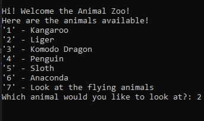
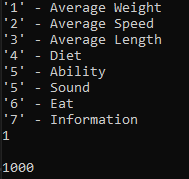
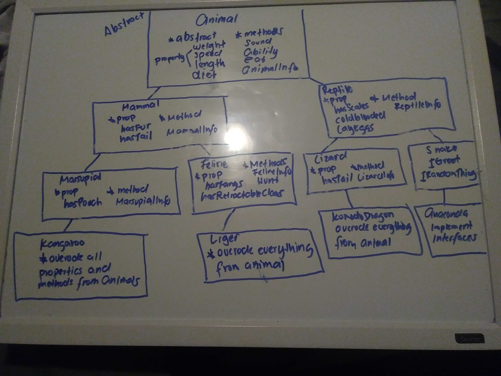

# Console Application

## Animal Zoo

*Author: Joseph Hangarter*

----

## Description
* This is a C# console application utilizing `OOP` principles, and with `abstract classes` and `interfaces`.
* Contains characteristics and behaviors for certain animals.
* Navigate through the prompts by pressing numbers given on command line.
---

### Getting Started
Clone this repository to your local machine.

```
$ git clone [https://github.com/JCode1986/Animal-Zoo.git]
```

### To run the program from Visual Studio:
Select ```File``` -> ```Open``` -> ```Project/Solution```

Next navigate to the location you cloned the Repository.

Double click on the ```Animal-Zoo``` directory.

Then select and open ```Animal-Zoo.sln```

---

### Visuals

#### Application Start

#### Using the Application


### Visuals


---

### Resources animals were located on:
* [Wikipedia](https://www.wikipedia.org/)
------------------------------

